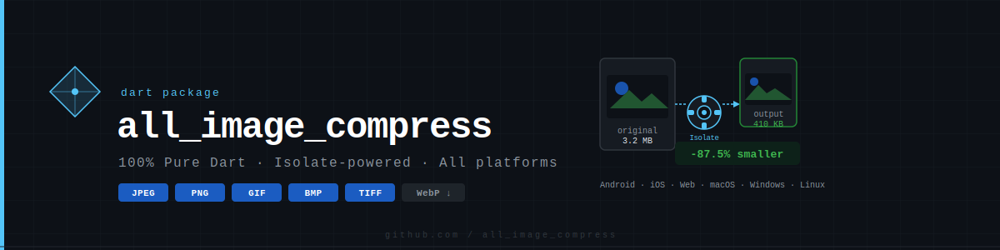
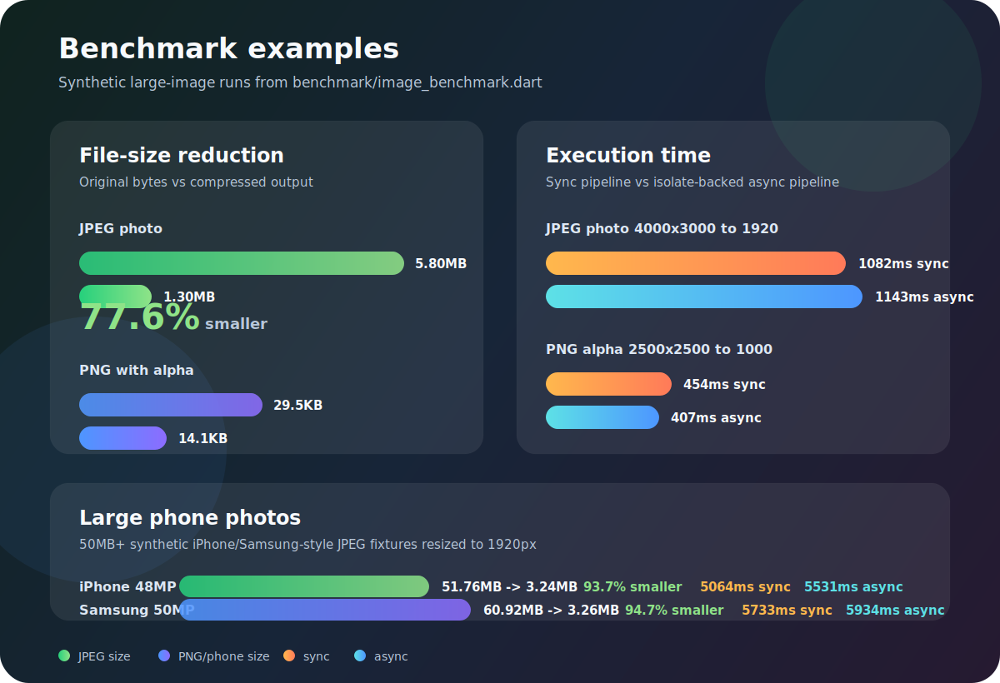

<p align="center">
  
</p>

<h1 align="center">all_image_compress</h1>

<p align="center">
  🗜️ Compressão de imagens poderosa, 100% Dart puro — sem código nativo, sem platform channels.
</p>

<p align="center">
  🌐 <a href="README.en.md">Read this in English</a>
</p>

<p align="center">
  <a href="https://pub.dev/packages/all_image_compress"></a>
  <a href="https://pub.dev/packages/all_image_compress/score"></a>
  <a href="https://pub.dev/packages/all_image_compress/score"></a>
  <a href="https://github.com/CriandoGames/all_image_compress/blob/main/LICENSE"></a>
  
</p>

---

## 🚀 Descrição do Projeto

**all_image_compress** é uma biblioteca Dart/Flutter para compressão de imagens com quatro pilares:

- **100% Dart puro** — sem Kotlin, sem Objective-C, sem platform channels. Funciona em todas as plataformas Flutter (Android, iOS, Web, macOS, Windows, Linux).
- **Isolate-powered** — toda compressão roda em background `Isolate`, nunca bloqueando a thread da UI.
- **Multi-formato** — entrada: JPEG, PNG, GIF, BMP, TIFF, WebP, TGA, ICO, PVR (auto-detectado por magic bytes). Saída: JPEG, PNG, GIF, BMP, TIFF.
- **API simples e poderosa** — compressão única, batch com progresso, controle de qualidade, resize inteligente, rotação e auto-correção de EXIF.

---

## 📦 Instalação

Adicione ao seu `pubspec.yaml`:

```yaml
dependencies:
  all_image_compress: ^1.0.0
```

Em seguida:

```bash
flutter pub get
```

E importe no seu código:

```dart
import 'package:all_image_compress/all_image_compress.dart';
```

---

## ⚙️ Uso Rápido

```dart
import 'package:all_image_compress/all_image_compress.dart';

// Comprime bytes — roda em Isolate automaticamente
final result = await AllImageCompress.fromBytes(
  bytes: rawImageBytes,
  config: CompressConfig(
    quality: 80,
    maxWidth: 1920,
    maxHeight: 1080,
    outputFormat: CompressFormat.jpeg,
  ),
);

print(result.summary);
// → "3.20MB → 410.50KB (-87.5%) 1920×1080px [JPEG]"

// Use os bytes diretamente
final widget = Image.memory(result.bytes);
await File(outputPath).writeAsBytes(result.bytes);
```

---

## Helpers de Resize

Use estes atalhos quando quiser expressar a intencao sem montar manualmente `CompressConfig`:

```dart
final thumb = await AllImageCompress.fitWidth(
  bytes: rawImageBytes,
  maxWidth: 320,
  config: CompressConfig(quality: 80),
);

final preview = await AllImageCompress.fitHeight(
  bytes: rawImageBytes,
  maxHeight: 720,
);

final contained = await AllImageCompress.contain(
  bytes: rawImageBytes,
  maxWidth: 1280,
  maxHeight: 720,
);
```

Tambem existem as variantes sincronas `fitWidthSync`, `fitHeightSync` e `containSync` para uso fora da UI thread.

Nota de formatos: WebP e suportado apenas como entrada nesta versao. Se `outputFormat` for `null`, entradas WebP sao reencodadas como JPEG. AVIF e HEIC ainda nao sao suportados pelo backend Dart puro usado pelo pacote.

---

## Benchmark visual

Resultados de exemplo gerados localmente com `dart run benchmark/image_benchmark.dart`.

<p align="center">
  
</p>

| Caso | Saida | Tamanho | Sync | Async |
|------|-------|---------|------|-------|
| `jpeg_photo_4000x3000_to_1920` | `1920x1440 jpeg` | `5.80MB -> 1.30MB` | `1082ms` | `1143ms` |
| `png_alpha_2500x2500_to_1000` | `1000x1000 png` | `29.5KB -> 14.1KB` | `454ms` | `407ms` |

> Benchmarks variam por maquina, modo de build e conteudo da imagem. Use estes numeros como exemplo visual e rode o script no seu ambiente para comparar.

### Fotos grandes de celular

Casos sinteticos de alta resolucao, proximos de fotos grandes de iPhone/Samsung:

| Caso | Entrada | Saida | Reducao | Sync | Async |
|------|---------|-------|---------|------|-------|
| `iphone_48mp_8064x6048_to_1920` | `51.76MB` | `3.24MB` | `93.7%` | `5064ms` | `5531ms` |
| `samsung_50mp_8160x6120_to_1920` | `60.92MB` | `3.26MB` | `94.7%` | `5733ms` | `5934ms` |

```bash
dart run benchmark/phone_large_benchmark.dart
```

Tambem existe um teste pesado opcional para validar imagem acima de 50MB:

```bash
flutter test test/large_image_compress_test.dart --dart-define=RUN_LARGE_IMAGE_TESTS=true
```

---

## 📱 Helpers para Arquivo (não-web)

```dart
import 'package:all_image_compress/all_image_compress.dart';
import 'package:all_image_compress/all_image_compress_io.dart';

// De um caminho de arquivo
final result = await compressFile(
  path: '/storage/photos/large.jpg',
  config: CompressConfig(quality: 75, maxWidth: 1280),
);

// Arquivo → Arquivo
await compressFileToFile(
  inputFile: File('/photos/original.png'),
  outputFile: File('/photos/thumbnail.jpg'),
  config: CompressConfig(quality: 85, maxWidth: 400, maxHeight: 400),
);
```

---

## 🗂️ Batch com Progresso

```dart
final results = await AllImageCompress.batchUniform(
  images: [img1, img2, img3],
  config: CompressConfig(quality: 70, maxWidth: 800),
  maxConcurrent: 3, // limite de isolates simultâneos (default: 3)
  onProgress: (done, total) => print('$done/$total'),
);

// Config diferente por imagem
final results = await AllImageCompress.batch(
  items: [
    (profilePhoto, CompressConfig(quality: 90, maxWidth: 512)),
    (coverPhoto,   CompressConfig(quality: 75, maxWidth: 1920)),
    (thumbnail,    CompressConfig(quality: 60, maxWidth: 200)),
  ],
  maxConcurrent: 2, // para galerias grandes, mantenha 2–4
);
```

---

## 🎛️ CompressConfig — Referência

| Parâmetro | Tipo | Padrão | Descrição |
|-----------|------|--------|-----------|
| `quality` | `int` | `85` | 0–100. JPEG: qualidade visual. PNG: nível de compressão zlib (100=menor arquivo/mais lento, 0=maior arquivo/mais rápido). |
| `maxWidth` | `int?` | `null` | Reduz escala se a largura exceder este valor. `null` = sem limite. |
| `maxHeight` | `int?` | `null` | Reduz escala se a altura exceder este valor. `null` = sem limite. |
| `outputFormat` | `CompressFormat?` | `null` | Formato de saída. `null` = mesmo do input (WebP → JPEG). |
| `rotate` | `int` | `0` | Rotação horária: `0`, `90`, `180` ou `270`. |
| `autoCorrectOrientation` | `bool` | `true` | Aplica e remove o tag EXIF de orientação. |
| `interpolation` | `CompressInterpolation` | `linear` | Algoritmo de resize: `nearest`, `linear`, `cubic`, `average`. |
| `keepExif` | `bool` | `false` | Preserva metadados EXIF (apenas JPEG; tag de orientação sempre removida). |

---

## 📊 CompressResult — Estatísticas

```dart
result.bytes               // Uint8List — imagem comprimida
result.width               // int — largura em pixels
result.height              // int — altura em pixels
result.format              // CompressFormat — formato de saída
result.originalSizeBytes   // int — tamanho original
result.compressedSizeBytes // int — tamanho comprimido
result.compressionRatio    // double — comprimido/original (0.13 = 87% menor)
result.savedBytes          // int — bytes economizados
result.savedPercent        // double — percentual de redução
result.summary             // String — resumo legível em uma linha
```

---

## 🖼️ Formatos Suportados

| Formato | Entrada | Saída | Qualidade |
|---------|---------|-------|-----------|
| JPEG    | ✅      | ✅    | ✅ lossy  |
| PNG     | ✅      | ✅    | nível de compressão |
| GIF     | ✅      | ✅    | ignorada  |
| BMP     | ✅      | ✅    | ignorada  |
| TIFF    | ✅      | ✅    | ignorada  |
| WebP    | ✅      | ❌ → JPEG | — |
| TGA     | ✅      | ❌    | —         |
| ICO     | ✅      | ❌    | —         |

---

## 🔄 API Síncrona (fora da UI thread)

Para uso dentro de `Isolate.run()`, `compute()`, CLIs ou testes:

```dart
final result = AllImageCompress.fromBytesSync(
  bytes: imageBytes,
  config: CompressConfig(quality: 80),
);
```

> ⚠️ **Nunca chame este método na Flutter UI thread.** Use `fromBytes()` para isso.

---

## 🏗️ Por que Dart Puro?

A maioria das libs de compressão (flutter_image_compress, fast_image_compress) dependem de código nativo Kotlin/ObjC — limitando-as a Android e iOS, e exigindo configurações de `Podfile` e `build.gradle`.

**all_image_compress** usa o pacote [`image`](https://pub.dev/packages/image) (3.9M+ downloads) como motor de codecs e delega todo o trabalho ao `Isolate.run()` nativo do Dart:

- ✅ Suporte universal (incluindo **Web** e **Desktop**)
- ✅ Sem overhead de JNI/FFI/platform-channel
- ✅ `flutter pub add all_image_compress` — pronto, sem configuração nativa

---

## 👥 Contribuidores

[](https://github.com/CriandoGames/all_image_compress/graphs/contributors)

Made with [contrib.rocks](https://contrib.rocks).

Contribuições são bem-vindas! Leia o [CONTRIBUTING.md](CONTRIBUTING.md) para começar.

---

## 📄 Licença

Distribuído sob a licença MIT. Veja [LICENSE](LICENSE) para mais detalhes.

---

<p align="center">💻 Desenvolvido com ❤️ para facilitar o desenvolvimento Flutter em todas as plataformas.</p>
